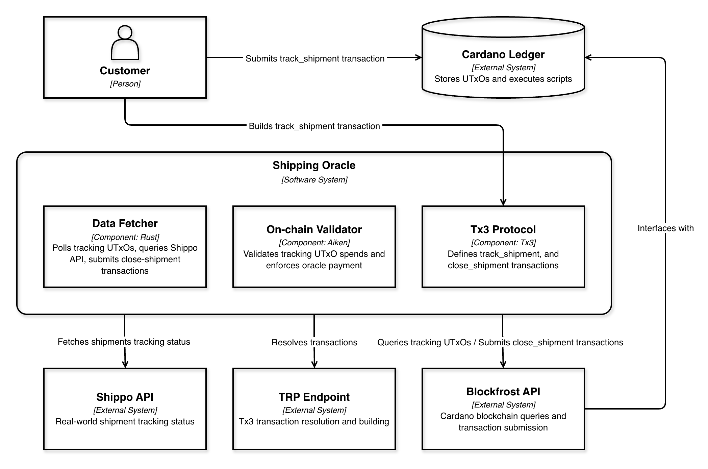
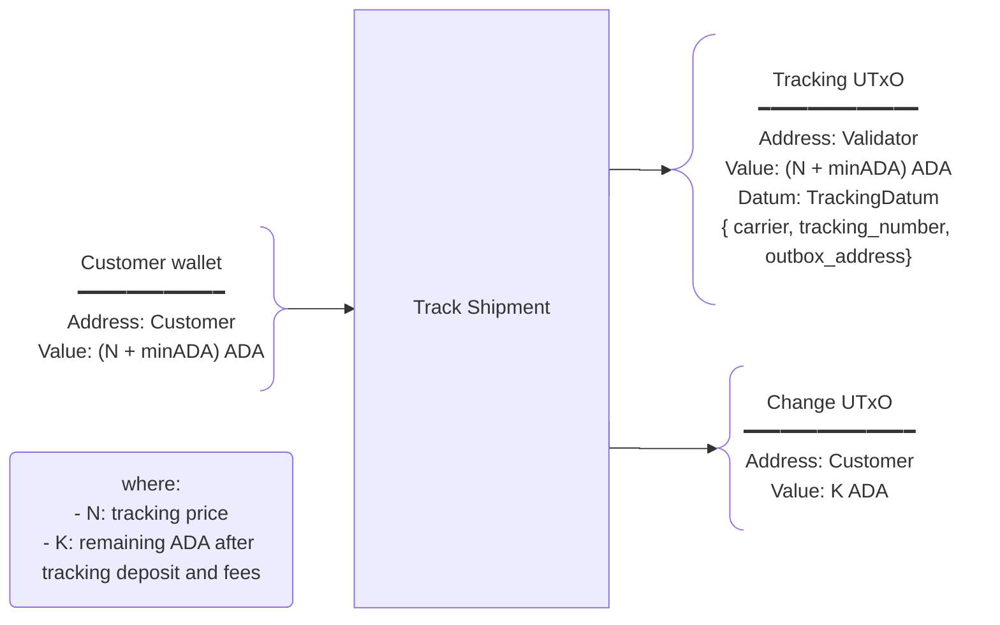
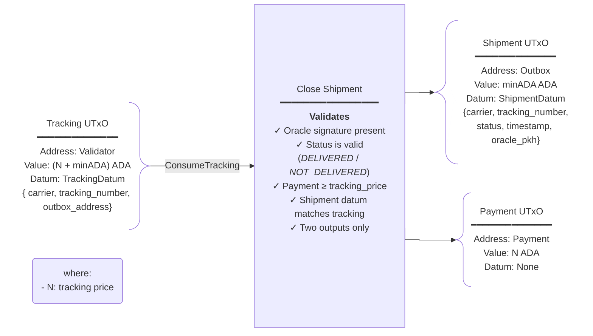

# Shipping Oracle

**A Cardano oracle for tracking shipments**

Shipping Oracle enables trustless, verifiable shipment status verification by combining on-chain smart contracts with off-chain oracle services. Customers create tracking requests on-chain, and an oracle service monitors real-world shipment status via carrier APIs, updating the blockchain when shipments reach final states.

## How It Works

1. **Track**: A customer creates a tracking request by locking funds in a [Tracking UTxO](#track-shipment) at the validator address.
2. **Poll**: The backend fetcher continuously polls the validator address for tracking UTxOs and queries shipment status via Shippo API.
3. **Close**: When a shipment reaches final status (`DELIVERED`/`NOT_DELIVERED`), the oracle submits a [close-shipment transaction](#close-shipment), unlocking the tracking UTxO and sending the status result to the customer's outbox address.

## Project Structure

```
shipping-oracle/
├── backend/          # Rust data fetcher (polls tracking UTxOs, queries Shippo, submits updates)
├── onchain/          # Aiken validator (validates tracking UTxO spends)
└── tx3/              # tx3 protocol definitions (publish, track_shipment, close_shipment)
```

**Component Documentation:**
- [Backend Documentation](backend/README.md) - Data fetcher setup and operation
- [On-chain Documentation](onchain/README.md) - Validator logic and validation rules
- [Tx3 Documentation](tx3/README.md) - Protocol definitions and transactions

## Architecture

### System Overview (C4 Container)


### Components

#### Backend
Scheduled Rust service that continuously monitors the Cardano blockchain for tracking UTxOs. For each tracking UTxO found, it queries the Shippo API to retrieve real-world shipment status. When a shipment reaches a final state (delivered or not delivered), the backend constructs and submits a close-shipment transaction to update the on-chain status and collect the oracle payment.

**Key Responsibilities:**
- Poll validator address for tracking UTxOs via Blockfrost
- Query Shippo API for shipment tracking status
- Determine if shipment status is final
- Build and submit close-shipment transactions via tx3/TRP
- Execute on configurable cron schedule

#### On-chain
Aiken validator that governs tracking UTxO spends. Enforces critical rules to ensure tracking requests can only be closed by authorized oracles with valid shipment statuses.

**Validation Rules:**
- Transaction must have exactly two outputs (shipment + payment)
- Shipment output must go to the outbox address specified in TrackingDatum
- Shipment output must contain valid ShipmentDatum with matching carrier/tracking number
- Status must be either "DELIVERED" or "NOT_DELIVERED"
- Oracle must sign the transaction (verified via extra signatories)
- Payment output must send at least `tracking_price` lovelace to payment address
- Payment output must have no datum attached

#### Tx3
Protocol definitions written in tx3 that specify the structure and rules for all Cardano transactions in the system. Compiled into transaction intermediate representation (TIR) that can be resolved into concrete Cardano transactions via the TRP service.

**Transactions:**
- `publish`: Publishes validator script on-chain as a reference script
- `track_shipment`: Creates tracking UTxO with customer's carrier and tracking number
- `close_shipment`: Consumes tracking UTxO and emits shipment status result

## Main Concepts

### Oracle
The operator running the backend fetcher service. The oracle continuously monitors tracking UTxOs, queries real-world shipment status from carrier APIs, and submits close-shipment transactions when shipments reach final status. The oracle signs close-shipment transactions with their private key and receives payment for providing tracking updates.

### Customer
User creating shipment tracking requests. The customer funds tracking UTxOs with ADA to initiate tracking, specifying the carrier, tracking number, and outbox address where they want to receive the final status result.

### Outbox Address
Destination address where the shipment status output (ShipmentDatum) is sent when a tracking request is closed. This address is specified by the customer in the TrackingDatum and controls where the final tracking result is delivered.

### Payment Address
Address that receives the oracle's payment when a shipment is successfully closed. This address is configured in the validator and compensates the oracle for monitoring shipments and providing status updates. The payment comes from the funds originally locked in the tracking UTxO.

## Transactions

### Track Shipment

Creates a tracking request on-chain by locking funds at the validator address.

**Purpose**: Customer initiates shipment tracking by creating a tracking UTxO containing carrier and tracking number information.

#### Data Structures

**Inputs:**
- Customer funds UTxO containing sufficient ADA (to cover tracking price deposit + fees + change)

**Outputs:**
- **Tracking UTxO** (locked at validator address)
  - Value: `TRACKING_PRICE` ADA + min UTxO requirement
  - Datum: `TrackingDatum`
- **Change UTxO** (returned to customer)
  - Value: Remaining ADA after tracking deposit and fees

**TrackingDatum:**
```aiken
type TrackingDatum {
  carrier: ByteArray,           // e.g., "usps", "fedex", "ups"
  tracking_number: ByteArray,   // Shipment tracking number
  outbox_address: Address,      // Where to send final status result
}
```

**Comments:**
- The `TRACKING_PRICE` value depends on the configured parameter on the on-chain validator. More information [here](onchain/README.md#parameters).

#### Transaction Diagram



### Close Shipment

Oracle closes the tracking request by consuming the tracking UTxO and emitting the final shipment status.

**Purpose**: Consume tracking UTxO and emit shipment status result to the customer's outbox address while paying the oracle for their service.

#### Data Structures

**Inputs:**
- **Tracking UTxO** (from validator)
  - Value: `TRACKING_PRICE` ADA + min UTxO
  - Datum: `TrackingDatum`
  - Redeemer: `ConsumeTracking`

**Outputs:**
- **Shipment UTxO** (to outbox address)
  - Value: min UTxO requirement (~2 ADA)
  - Datum: `ShipmentDatum`
- **Payment UTxO** (to payment address)
  - Value: `TRACKING_PRICE` ADA (tracking deposit minus shipment UTxO value and fees)
  - Datum: None

**Redeemer:**
```aiken
type TrackingRedeemer {
  ConsumeTracking    // Signals intent to close tracking request
}
```

**ShipmentDatum:**
```aiken
type ShipmentDatum {
  carrier: ByteArray,              // Matches TrackingDatum.carrier
  tracking_number: ByteArray,      // Matches TrackingDatum.tracking_number
  status: ByteArray,               // "DELIVERED" or "NOT_DELIVERED"
  timestamp: Int,                  // Unix timestamp when status was recorded
  oracle_pkh: VerificationKeyHash, // Oracle's public key hash (for verification)
}
```

**Comments:**
- The `TRACKING_PRICE` value depends on the configured parameter on the on-chain validator. More information [here](onchain/README.md#parameters).

#### Transaction Diagram



## Data Structures

All on-chain data types used across the protocol.

### TrackingDatum

Attached to tracking UTxOs locked at the validator address. Contains the shipment information and destination for results.

```aiken
type TrackingDatum {
  carrier: ByteArray,           // Carrier identifier (e.g., "usps", "fedex", "ups")
  tracking_number: ByteArray,   // Shipment tracking number from carrier
  outbox_address: Address,      // Cardano address to receive ShipmentDatum result
}
```

### ShipmentDatum

Attached to shipment UTxOs sent to the outbox address. Contains the final tracking status and verification information.

```aiken
type ShipmentDatum {
  carrier: ByteArray,              // Carrier identifier (must match TrackingDatum)
  tracking_number: ByteArray,      // Tracking number (must match TrackingDatum)
  status: ByteArray,               // Final status: "DELIVERED" or "NOT_DELIVERED"
  timestamp: Int,                  // Unix timestamp when status was determined
  oracle_pkh: VerificationKeyHash, // Public key hash of oracle that submitted update
}
```

### TrackingRedeemer

Used when spending tracking UTxOs from the validator.

```aiken
type TrackingRedeemer {
  ConsumeTracking    // Single variant indicating tracking request closure
}
```

### Status Constants

Valid shipment status values enforced by the validator.

```aiken
pub const status_delivered: ByteArray = "DELIVERED"
pub const status_not_delivered: ByteArray = "NOT_DELIVERED"
```
