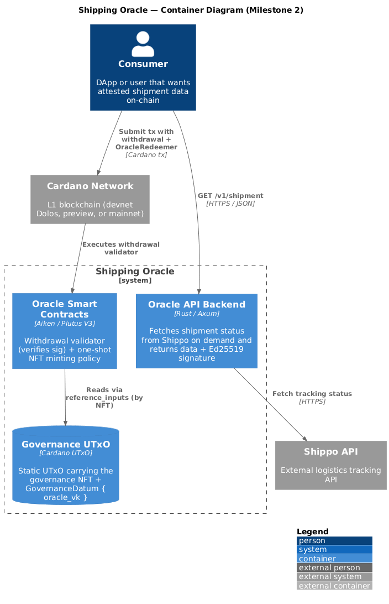
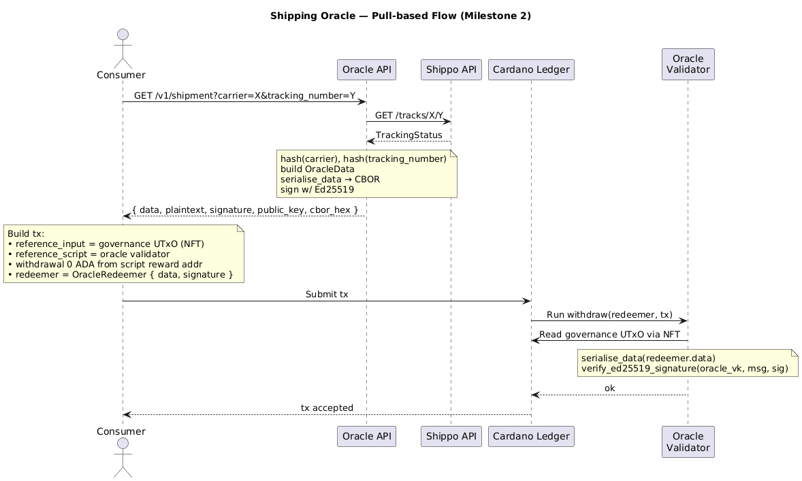

# Shipping Oracle

**A Cardano pull-based oracle for shipment tracking**

Shipping Oracle exposes signed, verifiable shipment status information to any Cardano smart contract. The architecture is inspired by [Pyth](https://pyth.network): the oracle never submits transactions itself — it publishes a **signed attestation** over HTTP that consumers embed in their own transactions. On-chain, an Aiken **withdrawal validator** verifies the Ed25519 signature against a governance UTxO identified by a one-shot NFT.

> **Milestone 2 status:** the pull-based architecture is the current design. The previous push-based (cron-polling) model has been retired. See [`spec/001-milestone-2.md`](spec/001-milestone-2.md) for the full implementation plan.

## How It Works

1. **Consumer asks** the oracle: `GET /v1/shipment?carrier=usps&tracking_number=...`.
2. **Oracle fetches** the current status from the carrier API (Shippo), hashes the carrier + tracking number so no PII is exposed on-chain, and **signs** the Plutus-canonical CBOR of `OracleData`.
3. **Oracle replies** with `data`, `plaintext`, `signature`, `public_key`, and `cbor_hex`.
4. **Consumer builds** a Cardano transaction that:
   - adds the governance UTxO as a **reference input** (carries the oracle verification key),
   - attaches the oracle validator via the **withdrawal trick** (0-lovelace withdrawal from the script's reward address),
   - passes the signed `OracleRedeemer` in the withdrawal redeemer.
5. **On-chain validator** finds the governance UTxO via its unique NFT, reads `oracle_vk`, recomputes `serialise_data(OracleData)` and runs `verify_ed25519_signature`.

## Architecture

### Container view (C4)



### Pull-based sequence



Sources: [`diagrams/milestone-2-c4-container.puml`](diagrams/milestone-2-c4-container.puml), [`diagrams/milestone-2-sequence.puml`](diagrams/milestone-2-sequence.puml). Regenerate PNGs with `./diagrams/build.sh` (requires Docker; PNGs are committed so GitHub renders them without any build).

## Project Structure

```
shipping-oracle/
├── backend/          # Rust HTTP oracle (axum + pallas + ed25519-dalek)
├── sdk/              # Consumer SDKs (Rust + TypeScript)
├── onchain/          # Aiken validators (governance_nft mint + oracle withdraw)
├── tx3/              # TX3 protocol (publish_scripts, bootstrap_governance, consume_oracle_data)
├── diagrams/         # PlantUML C4 + sequence diagrams (sources + PNGs)
└── spec/             # Numbered implementation specs
```

## SDKs

The Milestone 3 SDKs live under [`sdk/`](sdk/):

- [`sdk/rust`](sdk/rust/README.md) — Rust SDK.
- [`sdk/typescript`](sdk/typescript/README.md) — TypeScript SDK (TS/Node apps; verification is byte-identical to the Rust SDK and the Aiken validator).

Both wrap the oracle HTTP contract and give consumers a typed flow for:

- fetching `GET /v1/shipment` attestations
- verifying the Ed25519 signature and canonical CBOR payload
- keeping application context such as `order_id` linked to the resulting shipment commitment

The Rust SDK additionally generates tx3-ready `consume_oracle_data` arguments.

## Escrow integration example

A runnable end-to-end example — an off-chain keeper that drives a deployed Cardano escrow from this oracle's `IN_TRANSIT` / `DELIVERED` signals — lives in the [tx3 e-commerce template](https://github.com/tx3-lang/tx3-ecommerce-template). See its [Oracle-Driven Escrow Settlement integration guide](https://github.com/tx3-lang/tx3-ecommerce-template/blob/main/docs/integration-escrow.md) for the full flow, trust model, the `IN_TRANSIT → mark_shipped` / `DELIVERED → release` mapping, the buyer-initiated refund rationale, and how to run the keeper.

## HTTP API

### `GET /v1/shipment`

```
GET /v1/shipment?carrier=usps&tracking_number=ABC123
```

Response:

```json
{
  "data": {
    "carrier_hash": "abc…",
    "tracking_number_hash": "def…",
    "status": "DELIVERED",
    "timestamp": 1712000000
  },
  "plaintext": {
    "carrier": "usps",
    "tracking_number": "ABC123"
  },
  "signature": "hex…",
  "public_key": "hex…",
  "cbor_hex": "d8799f…ff"
}
```

| Field          | What it is                                                                 | On-chain use               |
| -------------- | -------------------------------------------------------------------------- | -------------------------- |
| `data`         | Hashed identifiers + status + timestamp                                    | Contents of `OracleData`   |
| `plaintext`    | Original carrier / tracking number (UX only, never signed)                 | —                          |
| `signature`    | Ed25519 over `cbor_hex` bytes                                              | Redeemer `signature`       |
| `public_key`   | Oracle verification key (32 bytes, matches `GovernanceDatum.oracle_vk`)    | Verified against governance UTxO |
| `cbor_hex`     | Canonical CBOR of the PlutusData form of `data` — **embed these bytes verbatim** | Redeemer `data` (raw) |

The status vocabulary is `DELIVERED`, `NOT_DELIVERED`, `IN_TRANSIT`, `PRE_TRANSIT`, `UNKNOWN`. Consumers decide what to do with non-final states (unlike the old model, which only surfaced final statuses).

### `GET /health`

Liveness probe, returns `{ "status": "ok" }`.

## Data Types

### Off-chain (Rust) and on-chain (Aiken) stay byte-aligned

`OracleData` is serialised as `PlutusData::Constr(0, [carrier_hash, tracking_number_hash, status, timestamp])` with an **indefinite-length** field array — byte-identical between `pallas::codec::minicbor` and Aiken's `builtin.serialise_data`. This alignment is the #1 technical risk and is verified by [`backend/tests/cbor_alignment.rs`](backend/tests/cbor_alignment.rs) and [`onchain/lib/cbor_alignment_tests.ak`](onchain/lib/cbor_alignment_tests.ak) using three shared test vectors.

```aiken
// onchain/lib/types.ak
type GovernanceDatum { oracle_vk: ByteArray }

type OracleData {
  carrier_hash: ByteArray,
  tracking_number_hash: ByteArray,
  status: ByteArray,
  timestamp: Int,
}

type OracleRedeemer {
  data: OracleData,
  signature: ByteArray,
}
```

### On-chain identity via one-shot NFT

The governance UTxO (the UTxO whose datum holds `oracle_vk`) is identified by a unique token minted by a one-shot minting policy that requires consuming a specific seed UTxO. Anyone can send UTxOs to the oracle's address, but only **one** UTxO in the universe carries the governance NFT. Rotating the oracle key = move the NFT to a new UTxO.

## Running Locally

```bash
# 1. On-chain: compile validators + run tests
cd onchain
aiken check            # unit tests + CBOR alignment
aiken build            # emit plutus.json

# 2. Backend: run unit + HTTP integration tests (no network access required,
#    Shippo is stubbed via wiremock)
cd ../backend
cargo test             # backend/tests/*.rs + backend/tests/cbor_alignment.rs

# 3. Backend: run the HTTP server (requires Shippo + Cardano env vars)
cp .env.example .env   # fill ORACLE_SK, SHIPPO_API_KEY, TRP_URL, ...
cargo run
curl 'http://localhost:3000/v1/shipment?carrier=usps&tracking_number=...'

# 4. SDK: run the Rust SDK tests and examples
cd ../sdk/rust
cargo test --all-targets -- --nocapture
```

### Required env

| Variable          | Purpose                                                  |
| ----------------- | -------------------------------------------------------- |
| `SHIPPO_API_KEY`  | Shippo tracking API token                                |
| `ORACLE_SK`       | Oracle Ed25519 signing key (32 bytes, hex)               |
| `ORACLE_PKH`      | Oracle verification key hash (28 bytes, hex)             |
| `ORACLE_ADDRESS`  | Cardano address the oracle controls                      |
| `TRP_URL`         | TRP endpoint (used by consumers to resolve tx3 txs)      |
| `LISTEN_ADDRESS`  | HTTP bind address (optional, default `0.0.0.0:3000`)     |
| `TRP_API_KEY`     | Optional — required for hosted TRPs                      |

## License

Licensed under the Apache License, Version 2.0. See `LICENSE`.
